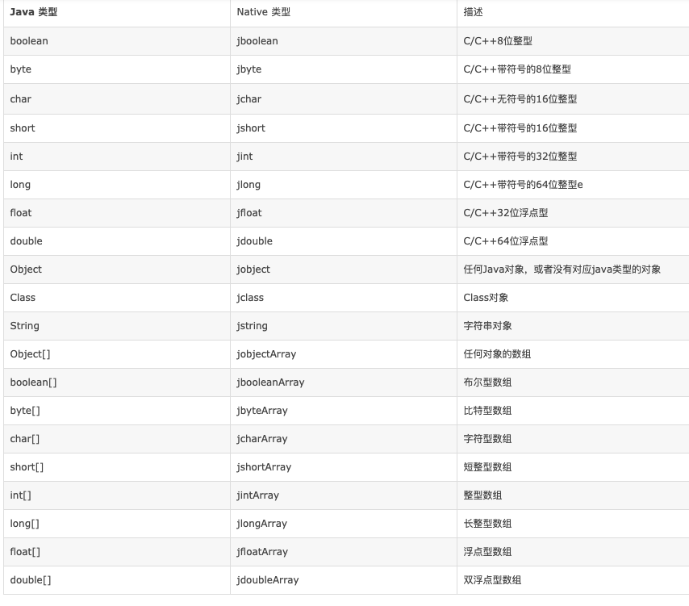

# Jni 学习

[参考1](https://blog.qingyuyu.cn/post/jdk11-de-jni-bian-cheng/)
[参考2](https://www.cnblogs.com/chenmo-xpw/p/7501325.html)
[参考3](https://www.cnblogs.com/ylz8401/p/9605498.html)

[传参](https://blog.csdn.net/u011520181/article/details/79765336)
## 边界java代码，创建 netive方法

```java
package top.chendaye666.test;

public class JniTest {
    public native void hello();

    public static void main(String[] args) {
        System.loadLibrary("JniTest");
        JniTest jniTest = new JniTest();
        jniTest.hello();
    }
}

```

## 编译头文件

```bash
javac -h 目标目录  *.java

/usr/local/jdk-11.0.7.jdk/Contents/Home/bin/javac -h  /Users/lengo/code/graduate_neo4j/jni/src/main/java/top/chendaye666/test/  /Users/lengo/code/graduate_neo4j/jni/src/main/java/top/chendaye666/test/JniTest.java
```

```C++
/* DO NOT EDIT THIS FILE - it is machine generated */
#include <jni.h>
/* Header for class top_chendaye666_test_JniTest */

#ifndef _Included_top_chendaye666_test_JniTest
#define _Included_top_chendaye666_test_JniTest
#ifdef __cplusplus
extern "C" {
#endif
/*
 * Class:     top_chendaye666_test_JniTest
 * Method:    hello
 * Signature: ()V
 */
JNIEXPORT void JNICALL Java_top_chendaye666_test_JniTest_hello
  (JNIEnv *, jobject);

#ifdef __cplusplus
}
#endif
#endif

```

## 实现 C++代码

> 方法名称 在 `javac -h 目标目录  *.java` 生成的头文件中
> 注意:拷贝生成的java头文件到cpp文件的同级目录；cpp引入头文件

```c
#include "top_chendaye666_test_JniTest.h"
#include <iostream>
#include <stdio.h>

JNIEXPORT void JNICALL Java_top_chendaye666_test_JniTest_hello
(JNIEnv *, jobject) {
    printf("tHello Jin");
}
```

## c++代码生成共享库 *.so 文件

> 两个重要文件：在 JAVA_HOME/include 目录 及其子目录下.可以拷贝 jni.h jni_md.h 到 cpp 同级目录
> 也可以在编译时 动态指定 jni.h jni_md.h 所在目录

- jni.h
- jni_md.h

```bash
# 生成 .o 文件
gcc -c -fPIC -I /home/pi/jdk-11/include -I /home/pi/jdk-11/include/linux ./jni/JNIDemo.c -o JNIDemo.o

# 注意动态链接库取名 必须以 lib作为前缀
# linux
gcc -shared JniTest.o -o libJniTest.so

# mac
gcc -dynamiclib -o libJniTest.dylib JniTest.o 

gcc -dynamiclib -I /Library/Java/JavaVirtualMachines/jdk1.8.0_144.jdk/Contents/Home/include HelloWorldImpl.c -o libJniTest.jnilib

```

## 设置共享库

> 当前共享库的目录: System.getProperty("java.library.path");

> 把动态链接库 放入 java.library.path

> 一设置要调用的C++动态链接库的位置
 
- IDEA vm options : -Djava.library.path=/Users/lengo/code/cpp
- 程序执行是显示指定: java -jar -Djava.library.path=/home/fly/Desktop/sound_dream sound.war

## 参数传递


